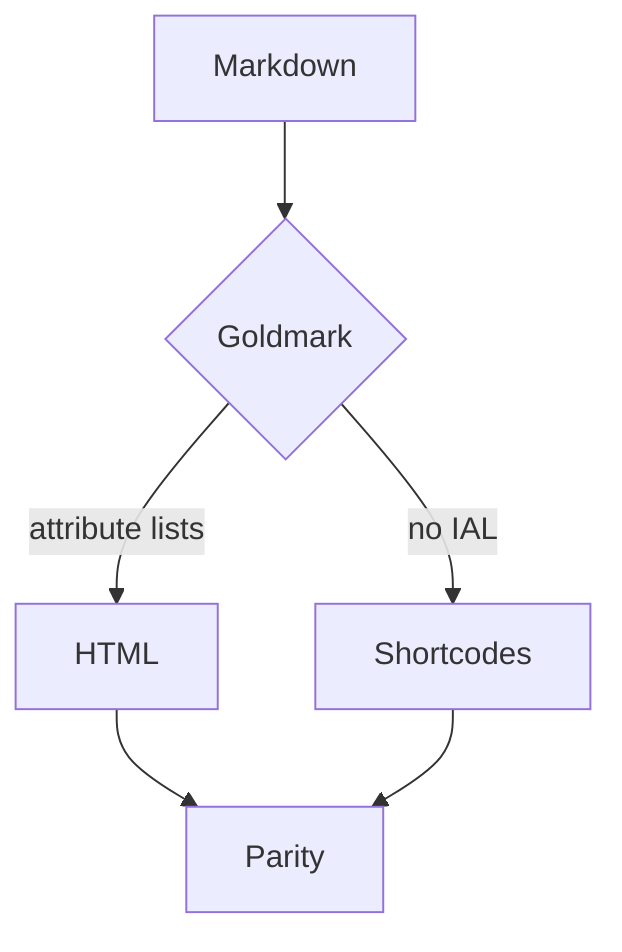
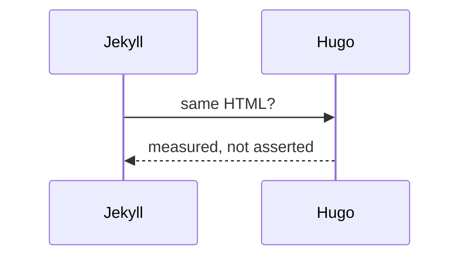

## Flowchart

```mermaid
graph TD
  A[Markdown] --> B{Goldmark}
  B -->|attribute lists| C[HTML]
  B -->|no IAL| D[Shortcodes]
  C --> E[Parity]
  D --> E
```

## Sequence

```mermaid
sequenceDiagram
  participant J as Jekyll
  participant H as Hugo
  J->>H: same HTML?
  H-->>J: measured, not asserted
```
